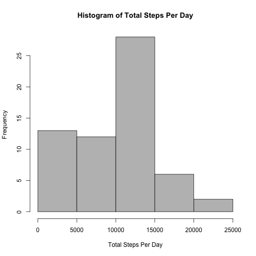
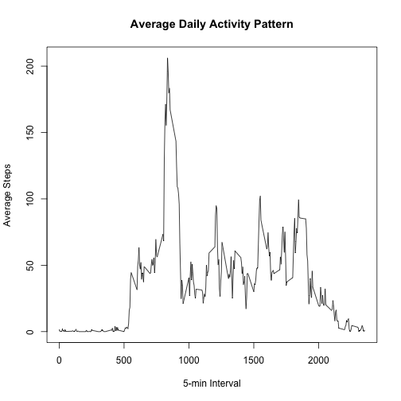
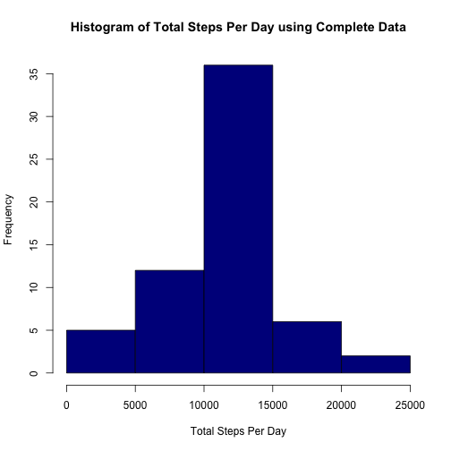
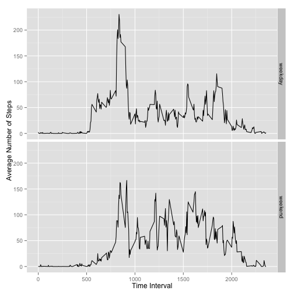

Reproducible Research Peer Assessment 1
=========================================================
## Activity monitoring data analysis

#### Introduction

Information about and access to the dataset can be found under the README document.

#### Loading and prepocessing the data

Load the data and specify column classes to be:

- steps = "numeric"
- date = "POSIXct"
- interval = "numeric"

This code will work as long as the file "activity.csv" is located within the working directory


```r
activity <- read.csv("activity.csv", header = TRUE, colClasses = c("numeric", "POSIXct", "numeric"))
```
#### Mean total number of steps taken per day

1. Calculate the total number of steps per day

I used the dplyr package to:

a. Group data by date
b. Summarize the steps with the sum function


```r
library(dplyr)
```


```r
TotalStepsPerDay <- 
activity %>% 
    group_by(date) %>% 
    summarize(TotalSteps = sum(steps, na.rm = TRUE))
```


2. Histogram of Average Steps Per Day

```r
hist(TotalStepsPerDay$TotalSteps,
     col = "gray",
     xlab = "Total Steps Per Day",
     main = "Histogram of Total Steps Per Day")
```

 

3. Mean and median of the total number of steps taken per day

The TotalStepsPerDay object created above was summarized with mean and median functions using the dplyr package.


```r
TotalStepsPerDay %>% summarize(Mean_Steps_per_Day = mean(TotalSteps, na.rm = TRUE), 
                               Median_Steps_per_Day = median(TotalSteps, na.rm = TRUE))
```

```
## Source: local data frame [1 x 2]
## 
##   Mean_Steps_per_Day Median_Steps_per_Day
## 1            9354.23                10395
```


#### Average daily activity pattern

The data was grouped by 5-min time interval, then each interval was averaged accross all days. These data were then used to create a plot representing an average daily activity pattern. 


```r
AvgActivity <-
    activity %>% 
    group_by(interval) %>%
    summarize(Average = mean(steps, na.rm=TRUE))    

plot(AvgActivity$interval, AvgActivity$Average, 
     type = "l",
     xlab = "5-min Interval",
     ylab = "Average Steps",
     main = "Average Daily Activity Pattern")
```

 


The maximum daily activity was calculated and reported below.

```r
AvgActivity[which.max(AvgActivity$Average),]
```

```
## Source: local data frame [1 x 2]
## 
##   interval  Average
## 1      835 206.1698
```

#### Imputing missing values

The missing values in the data can skew the data, so they were replaced and plotted with the following steps: 

1. Find the total number of missing values


```r
sum(is.na(activity))
```

```
## [1] 2304
```

2.Replace missing NA values with mean of each 5 min interval - stored in a varibale called Complete_activity which is identicial to activity, but missing values are imputed with the *mean of its corresponding 5 min interval* 


```r
Complete_activity <- 
    activity %>%
    group_by(interval) %>%
    mutate(steps = ifelse(is.na(steps), mean(steps, na.rm = TRUE), steps)) %>%
    ungroup()
```

3. Histogram of Complete_activity data


```r
CompleteTotalSteps <- 
    Complete_activity %>% 
    group_by(date) %>% 
    summarize(TotalSteps = sum(steps))

hist(CompleteTotalSteps$TotalSteps,
     col = "darkblue",
     xlab = "Total Steps Per Day",
     main = "Histogram of Total Steps Per Day using Complete Data")
```

 

4. Mean and Median of Complete_activity data


```r
CompleteTotalSteps %>% summarize(MeanComplete = mean(TotalSteps), 
                               MedianComplete = median(TotalSteps))
```

```
## Source: local data frame [1 x 2]
## 
##   MeanComplete MedianComplete
## 1     10766.19       10766.19
```

*Note* that the mean and median estimates are now equal, which differs from the fairly different values calculated without using estimates for missing values. Imputing the missing values increases both the mean and the median, but has a larger impact on the value of the mean - increasing its value by approximately 1400 steps. 

#### Weekday vs Weekend Activity

The weekday and weekend activity patterns were assesed with the following steps:

1. Create a variable weekdayFactor that is either weekday or weekend. 

First use the `weekdays()` function to make a column of the day of the week for the given date.


```r
Complete_activity[,"dayofweek"] <- weekdays(activity$date)
```

Then make a column weekdayFactor which includes "weekday" or "weekend" for the respective weekday or weekend days. 


```r
Complete_activity <- 
    Complete_activity %>%
    mutate(weekdayFactor = ifelse(dayofweek == "Sunday"| dayofweek == "Saturday",
                                  "weekend", "weekday")) %>%
    ungroup()
```

2. Plot total weekday and weekend steps by time interval

First sum the steps by time interval and weekend/weekday label


```r
StepsbyFactor <- 
    Complete_activity %>%
    group_by(weekdayFactor, interval) %>%
    summarize(TotalSteps = mean(steps))
```

Make a two panel plot of weekday vs weekend activity using ggplot2


```r
library(ggplot2)
```

```r
qplot(interval, TotalSteps, data=StepsbyFactor, 
      facets = weekdayFactor~., geom = "line",
      ylab = "Average Number of Steps", xlab = "Time Interval")
```

 
